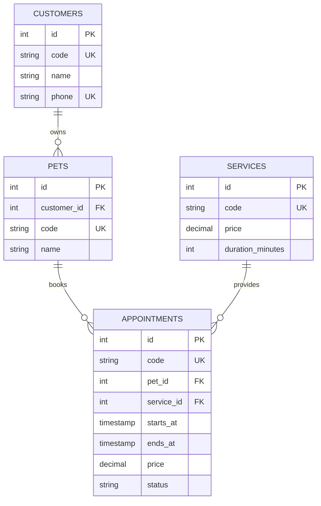

# Thiết kế phần mềm

Express nhận request, kiểm tra form bằng Zod, gọi repository với SQL parameters; EJS render HTML có escape dữ liệu. PostgreSQL lưu dữ liệu; pgAdmin kết nối qua hostname postgres. Thời gian lưu TIMESTAMPTZ và hiển thị Asia/Ho_Chi_Minh. Trình duyệt nhập giờ Việt Nam.

Không lưu customer_id dư thừa ở appointments: chủ sở hữu được xác định qua pet. Mỗi lịch có một dịch vụ. Đổi chủ thú cưng sẽ thay đổi chủ hiển thị trên lịch cũ; bản này không lưu snapshot chủ sở hữu.

Tạo/sửa lịch trong transaction; khóa hàng thú cưng FOR UPDATE trước khi kiểm tra overlap. Khoảng thời gian giao nhau khi lịch cũ.starts_at < mới.ends_at và lịch cũ.ends_at > mới.starts_at. Lịch cancelled không chiếm giờ. Lịch tiếp nối đúng giờ kết thúc được phép. Đây là lịch của thú cưng; chưa quản lý nhân viên, phòng spa hoặc công suất cửa hàng.

ON DELETE RESTRICT ngăn xóa khách còn thú cưng, thú cưng/dịch vụ còn lịch. UI hiển thị lý do; có thể xóa lịch demo trước khi xóa dữ liệu cha. Hủy lịch giữ lại lịch sử.

Trạng thái: scheduled, in_progress, completed, cancelled. Người vận hành có thể chỉnh trạng thái trực tiếp; chưa áp đặt quy trình chuyển trạng thái. Cho phép nhập lịch quá khứ để ghi nhận dữ liệu demo.

Biện pháp ban đầu: SQL parameters, EJS escape, CSRF cho POST, cookie httpOnly/sameSite, body limit, app non-root. Cần tiếp tục hardening ở giai đoạn sau: tài khoản DB tối thiểu quyền, network isolation, session store bền vững, headers/reverse proxy, xác thực khi mở cho người dùng thật.
